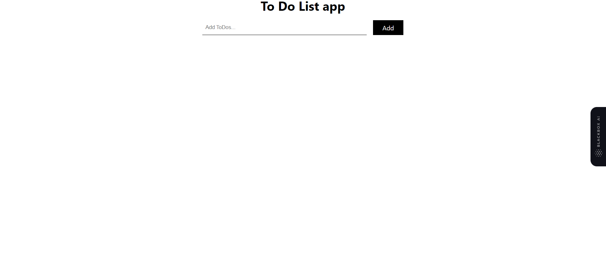

# Todo_List_App
this is Mern stack todo list app
# To do list app 

### ✨ [Live Demo]([https://beatbox-music.vercel.app](https://todo-list-app-one-delta.vercel.app/))

## Overview

BeatBox is a music app where users can listen to music, save music to their accounts and also create awesome playlists.

## Technologies Used

Built on the MERN Stack with `NodeJs` `ReactJs` `Express` `Chakra UI` `Redux Toolkit` and `MongoDB` for Database Management and storage.

## Author

👤 **Mesmak**  
Leave a ⭐️ If you like this project!

- Website: https://ikennaezef.netlify.app

## Screenshot

